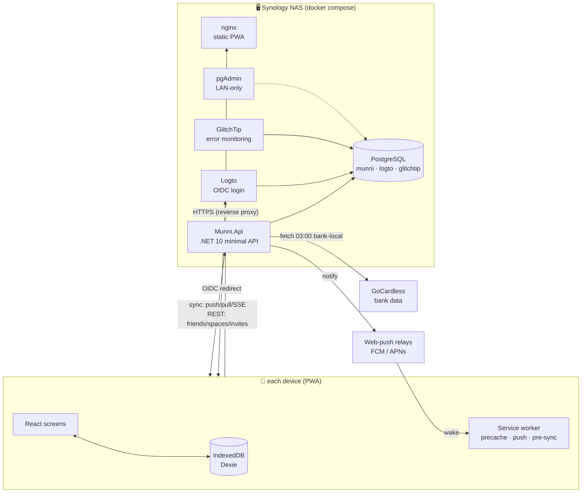
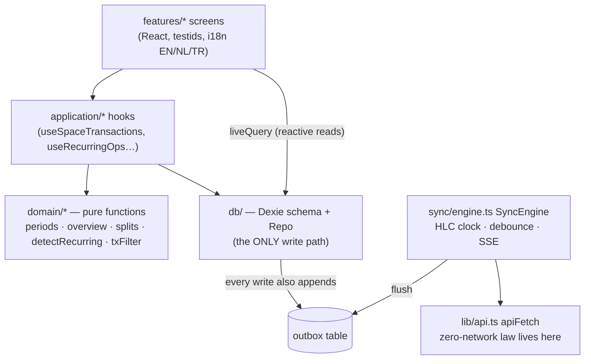
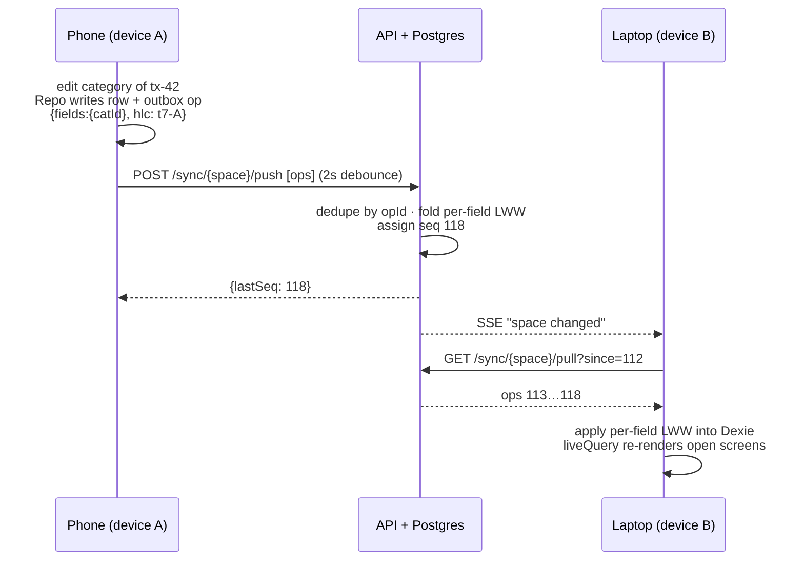
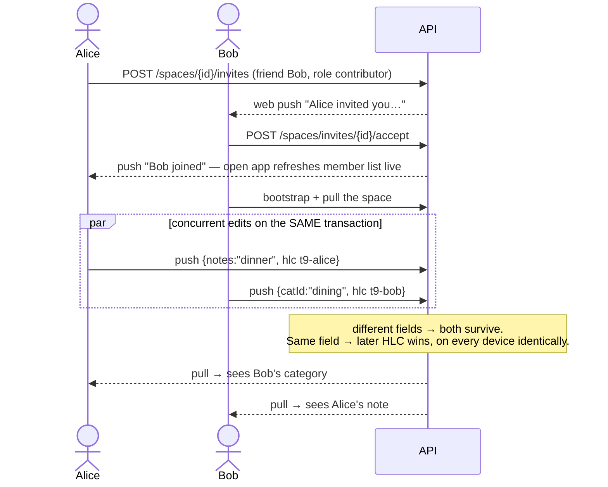
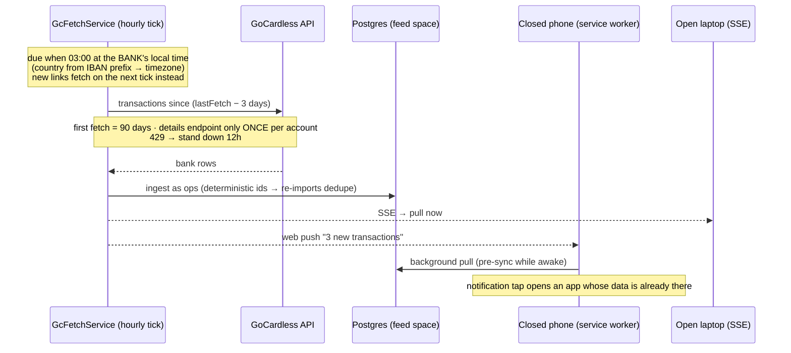
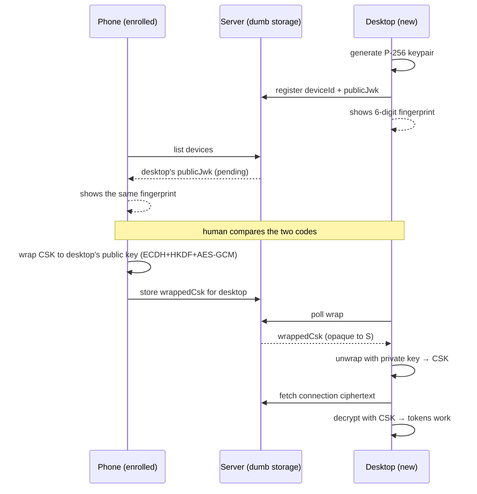
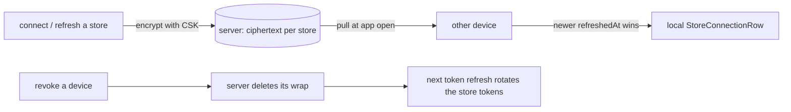
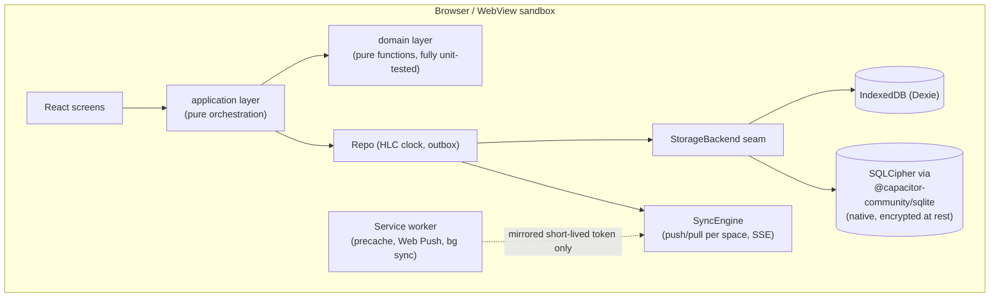
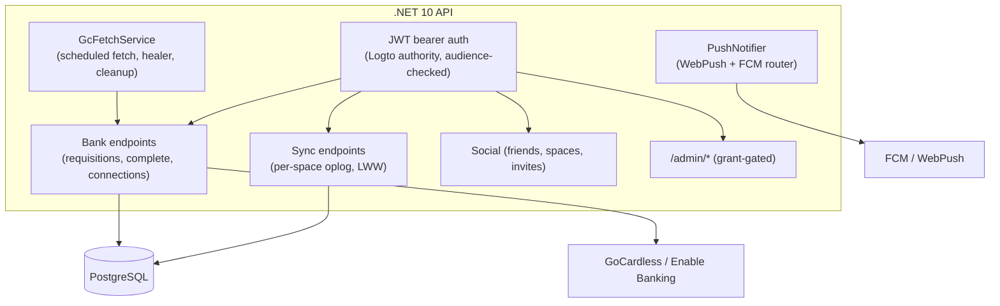
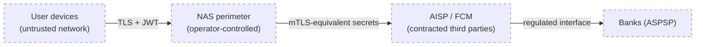

# munni — how it all works

A guided tour of the system: what runs where, how data flows, and what
happens when several people (and their devices) work on the same money.
Diagrams are [Mermaid](https://mermaid.js.org/) — GitHub renders them
inline.

## 1. Bird's eye

munni is **local-first**: every device keeps a full working copy of its
data in the browser's IndexedDB and works entirely from it. The server
is not "the app" — it is a sync relay + storage + the place where
things involving *other people* (accounts, invites, bank connections)
are mediated.



Three identity kinds run the **same app** with different wiring:

| Identity | Storage | Network | Telemetry |
|---|---|---|---|
| **user** (Logto) | IndexedDB per user | full sync + REST | queued offline, flushed online |
| **demo** | IndexedDB, reseeded on sign-out | **zero** — enforced at the `apiFetch` choke point | none, ever |
| **offline** profile | IndexedDB, kept — ONE profile per device (spaces separate bookkeeping, not parallel profiles) | **zero** | none, ever |

All three run the same first-run onboarding (profile, language,
country-of-use, optional app lock); conversions between the identity
kinds are designed product paths (docs/online-to-offline-plan.md and
the offline→online migration in docs/offline-backup-plan.md) — every
new feature must state its fate in both directions.

## 2. Frontend layering

The web app is layered so that everything interesting is a pure
function and everything stateful is thin:



Key rules:

- **Repo is the single write path.** It stamps every changed field with
  an HLC timestamp and appends an op to the outbox. Screens never touch
  Dexie tables directly for writes.
- **Reads are live.** Screens use `liveQuery`; when sync applies remote
  ops, every open screen re-renders by itself.
- **demo/offline get a `NoopSyncBackend`** — same Repo, same screens,
  the engine simply does nothing, and `apiFetch` *throws* for them so
  no forgotten code path can leak a request.

## 3. The sync protocol (one user, two devices)

Every piece of data belongs to a **space**. Each space has an append-only
op log on the server (`sync_ops`, with a per-space sequence) and a
materialized current state (`entity_rows`) the server keeps by folding
ops in — per **field**, latest HLC wins (LWW).



- **Offline is the normal case**: ops queue in the outbox for days if
  needed; on reconnect the engine flushes and pulls. Order of arrival
  never matters — HLC per field makes every interleaving converge.
- **New device**: `GET /sync/{space}/bootstrap` streams the materialized
  snapshot instead of replaying years of ops.
- Deletes are tombstones, so an offline device cannot resurrect a row.

## 4. Two people, one shared space

The server checks membership (`space_members`) on every sync call, but
stays **domain-agnostic** — it stores field bags, it does not know what
a "transaction" is. People-things (friendships, invites, membership,
roles) are classic REST, *not* synced data.



Editing presence ("Alice is reviewing — view only") rides the same SSE
channel, so two people rarely collide in the first place.

## 5. Bank data path (GoCardless)

Raw bank transactions are **stored once, in Postgres**, as ops in the
account's own **feed space** (`uuidv5("feed:" + IBAN)`). GoCardless is
only ever asked for the *delta*; clients never talk to GoCardless at
all — they sync from our copy like any other space.



The same deterministic-id trick makes a client-side **CAMT.053 file
import** of the same account merge cleanly with GoCardless data — the
file never leaves the device; only the resulting ops sync.

**Account tiers** (2026-07): *linked* (open banking) and *imported*
(statement uploads) accounts are user-level feed spaces attached to
spaces per-space (`accountLink`, with a history-from window and
detach); *manual* accounts are space-scoped and are the only tier that
accepts hand-typed transactions. Rows state their tier + provenance
(created here / yours / shared by a member) and last-sync freshness.
Two users consenting to the same IBAN share ONE feed (family
accounts): each consent is independent, fetch quota is spent once, and
one user's cleanup can never revoke the other's access. The next
evolution (shared import feeds, roles, evidence-based dedupe) is
designed in docs/financial-accounts-master-plan.md.

Rate budget math: GoCardless allows ~4 calls/endpoint/day. The nightly
schedule spends **1** transactions + **1** balances call per account per
day (details only on first link), leaving headroom for retries after a
429 deferral.

## 6. Notifications, three ways

| Path | When | How |
|---|---|---|
| **SSE** | app open | `/sync/events` → engine pulls; screens re-render via liveQuery; member lists/invites refresh on the same signal |
| **Web push** | app closed | server → FCM/APNs → service worker shows a localized notification (EN/NL/TR mirrored into worker storage) and pre-syncs the space |
| **Local reminders** | app opening | recurring-cost due-date reminders computed on device — the server never learns your recurring costs |

A notification **click** focuses the open app and posts a whitelisted
`NAVIGATE` message (friend request → Friends, invite → Spaces); a push
that arrives while the app is open is re-broadcast as a window event so
whatever screen you're watching refreshes in place.

## 7. What the server can and cannot see

- It sees space membership, op envelopes (entity name, field bags,
  HLCs) and bank data it fetched itself. That's what sync needs.
- It does **not** interpret finances: no category totals, no budgets,
  no reports server-side. All analysis (overview, recurring detection,
  budgets when they land) is client-side domain code — which is also
  why it works offline.
- Auth: Logto issues OIDC tokens; the API validates the bearer and
  provisions users just-in-time from `sub`. CI/test mode swaps in a
  header (`X-User-Sub`) so e2e can run without Logto.
- Errors: Sentry-protocol → GlitchTip; demo/offline identities send
  nothing, signed-in users queue crash reports offline and flush later.

## 7b. Store logins on your other devices (E2EE, opt-in)

Store connections (AH/Jumbo tokens) are device-only by default. The
opt-in sync (store-connection-sync design, SC1–SC3) keeps the privacy
law intact by making the server **dumb storage for ciphertext**:

- **CSK** — one AES-GCM-256 *Connection Sync Key* per user, minted on
  the first device that enables the feature. It encrypts every
  connection row before upload and never leaves a device unwrapped.
- **Device keys** — each device holds a P-256 ECDH keypair; only the
  public half is uploaded. The CSK travels between devices ECIES-style:
  an ephemeral keypair agrees (ECDH → HKDF-SHA256 → AES-GCM) with the
  *target's* public key, so only the target's private key can unwrap.
- **Fingerprints** — SHA-256 of the public point, shown as a 6-digit
  code on both screens during approval. The human comparison is the
  defence against the server substituting its own key (MITM).
- **Server surface** (`/me/store-sync/*`): device registry (public key
  + optional wrap), one ciphertext blob per store, and DELETEs for
  revocation. No crypto server-side; nothing stored is readable.

### Enrollment & approval



### Day-to-day flow



Loss of *all* devices means the CSK is gone — which loses ONLY the
synced store LOGINS (AH/Jumbo credentials): financial data, receipts
and everything else live in normal server-side sync and come back with
a fresh sign-in. You reconnect the stores once. That asymmetry is
deliberate — no escrow, no server-side recovery, no honeypot.

## 8. Activity, admin & the rest of the household

- **Activity history**: a synced per-space `activity` entity records
  who did what (newest 200 rows or 90 days); actors are frozen display
  names + subs so every member's device renders "You" correctly.
- **Admin console** (`apps/admin`): operator-only SPA behind its own
  Logto app + explicit server-side grant list — quota, user diagnosis,
  GDPR deletion, catalog publishing. Shares no code with the member
  app.
- **Infrastructure as code** (`infra/`): stack files + bootstrap mint
  secrets, render compose/env, drive Logto (apps, social connectors)
  and DSM reverse-proxy rules; see infra/README.md for the
  zero-to-running checklist. The NAS domain is a repo secret.

## 8b. Where things live

| Area | Path |
|---|---|
| Screens / features | `apps/web/src/features/*` |
| Pure domain logic | `apps/web/src/domain/*` |
| Dexie schema + Repo | `apps/web/src/db/*` |
| Sync engine + HLC | `apps/web/src/sync/*` |
| Service worker | `apps/web/src/sw.ts` (+ `sync/swNotifications.ts`) |
| API endpoints | `server/src/Munni.Api/*` (vertical slices) |
| Sync fold/merge (C# twin of the client) | `server/src/Munni.Api/Sync/*` |
| GoCardless ingest + schedule | `server/src/Munni.Api/GoCardless/*` |
| Compose stacks + runbook | `deploy/` |
| Active design docs | `docs/` (implemented designs are removed once shipped — recover any from git history) |

The authoritative sync semantics live in code, twice on purpose:
`apps/web/src/sync/` (TypeScript) and `server/src/Munni.Api/Sync/`
(C#) implement the same per-field LWW fold, and the convergence test
suites on both sides keep the twins honest. The accounts ⇄ spaces
evolution (global accounts, feed attachments, overlays) builds on
exactly the feed-space mechanics described in §5; its original design
doc (`shared-accounts-design.md`) shipped and lives in git history.

---

# Security review (PSD2 lens)

> Originally a standalone review (2026-07-19, v2.19.x), merged here
> 2026-07-23 and re-verified against the shipping code. munni is an
> **account-information consumer** (read-only AIS): it never initiates
> payments and never sees bank credentials — SCA happens exclusively
> at the bank, brokered by a licensed AISP (GoCardless Bank Account
> Data or Enable Banking).

## S1 · The apps in isolation

### S1.1 Web app (`apps/web`) — local-first PWA



* **Local-first**: every feature works offline; the server is only a sync
  relay. All writes go through the Repo → outbox → sync engine.
* **Encryption at rest**: on native shells the store can run on SQLCipher
  with a Keychain/Keystore-held passphrase. Browser storage relies on the
  OS user profile sandbox.
* **Telemetry discipline**: demo/offline identities have a hard
  zero-network gate (enforced at the single `apiFetch` choke point and a
  Sentry `beforeSend` gate). Only signed-in users emit crash reports.

### S1.2 Native shells (`apps/native`) — thin Capacitor wrappers

* Same web bundle, packaged; no additional business logic.
* OS integration only: push token registration (FCM/APNs), biometric app
  lock, haptics, camera (receipts), universal links
  (`/gc-callback`, `/splits/join/*`, `/native-auth*`).
* Keyboard resizes the WebView natively; the webview origin is
  `capacitor://localhost` — cookies/storage are app-sandboxed.

### S1.3 API (`server/`) — .NET 10, vertical slices



* **Access model**: every space read/write checks membership; feed spaces
  (raw bank data) are readable only through ownership or an explicit
  attachment (`SpaceAccountLink`), with archived links frozen at a
  sequence ceiling (departed members keep exactly the history they had).
* **AISP credentials** (GoCardless secret, Enable Banking RS256 private
  key) live only in server configuration (Docker env from the NAS
  `.env`), never in any client bundle.
* **Admin surface** is a separate Logto application and additionally
  gated by an explicit server-side admin grant list.

### S1.4 Admin console (`apps/admin`)

Operator-only React SPA: overview/quota, user management (incl. GDPR
deletion and per-user sync-chain diagnosis), bank-connection upkeep,
category catalog publishing. Shares **no code** with the member app and
holds no bank data of its own — everything goes through `/admin/*`.

## S2 · Cross-app flows

### S2.1 Sign-in (OIDC, code + PKCE)

```mermaid
sequenceDiagram
  participant App as Web/native app
  participant Logto
  participant API
  App->>Logto: authorize (code + PKCE, https universal-link redirect on native)
  Logto-->>App: code → tokens (access + rotating refresh)
  App->>API: Bearer access token (audience: munni API)
  API->>Logto: JWKS validation (cached)
  Note over App: token refresh is single-flighted;<br/>only a REJECTED bearer can clear the session
```

### S2.2 Bank consent (read-only AIS; SCA at the bank)

```mermaid
sequenceDiagram
  participant User
  participant App
  participant API
  participant AISP as GoCardless/EB
  participant Bank
  App->>API: create requisition (space, institution)
  API->>AISP: create consent, redirect=munni /gc-callback
  App->>AISP: user follows consent link
  AISP->>Bank: SCA — credentials + strong auth AT THE BANK only
  Bank-->>AISP: consent granted (90 days, read-only scopes)
  AISP-->>App: redirect to /gc-callback (universal link)
  App->>API: complete requisition (idempotent, quota-tolerant)
  API->>AISP: list accounts → ingest transactions
  API-->>App: feed space synced to every member device
  Note over API: hourly healer finishes interrupted consents;<br/>daily cleanup revokes unused ones at the AISP
```

munni never sees bank credentials; it stores only the AISP's account ids,
IBAN, and transaction data the user consented to. Consents are revocable
in-app (deletes the requisition at the AISP) and auto-expire.

### S2.3 Sync (the only data plane)

Per-space append-only oplog; hybrid logical clocks; last-writer-wins per
field. Devices push queued ops and pull since a cursor; membership is
re-derived server-side on every request. Access loss (leaving a space,
revoked share) purges the local copy on the next sync.

### S2.4 Push

Data payloads carry facts, not content decisions; visible text is
localized per device (server-side for FCM, in the service worker for Web
Push). Tokens are stored per user and pruned on 404/410.

## S3 · Security controls, mapped

| Concern (PSD2 / AIS lens) | Control in munni |
| --- | --- |
| SCA | Never performed by munni — delegated to the bank via a licensed AISP. |
| Scope of access | Read-only account information; no payment initiation exists anywhere in the codebase. |
| Consent lifetime | AISP-enforced (90 days); in-app revoke; server cleanup revokes idle consents at the provider. |
| Bank credentials | Never touch munni — entered only on the bank's own pages. |
| AISP secrets | Server-side env only; never in client bundles or the repo. |
| Transport | TLS everywhere (DSM reverse proxy, HSTS); native shells pin to https universal-link origins. |
| At rest (server) | PostgreSQL on the operator's NAS volume; deletion pipeline erases user data + revokes consents + deletes the IdP identity (prod). |
| At rest (device) | Native: optional SQLCipher store, passphrase in Keychain/Keystore; app lock via OS biometrics. |
| AuthN | OIDC code+PKCE via Logto; rotating refresh tokens; audience-checked JWTs; single-flighted refresh to avoid rotation races. |
| AuthZ | Space membership checks on every sync route; feed access derives from ownership/attachment with archive ceilings; admin = separate app + explicit grant list. |
| Multi-user shared accounts | Each consent lives independently per user; one user's cleanup can never revoke another's access. |
| Telemetry | PII-scrubbed error events only; demo/offline identities emit zero network traffic by construction. |
| Data minimization | Server stores only what sync needs (ops + derived rows); budgets/goals stay client-side interpretation of synced facts; no analytics/tracking of any kind. |
| Auditability | Append-only oplog per space; admin diagnosis surfaces the exact chain (feeds, attachments, consents) per user. |

## S4 · Trust boundaries at a glance



Residual risks worth stating honestly: the NAS is a single-operator,
single-node deployment (no HSM, no WAF beyond DSM defaults);
browser-profile storage on the plain web app is not additionally
encrypted; server data is not yet encrypted at rest and nightly
backups are still plaintext (the remediation order lives in
docs/backend-security-plan.md — encrypted backups first); and
GlitchTip receives stack traces which could incidentally contain
identifiers if a future code path interpolated them (the current
reporting scope tags are curated to avoid this).

